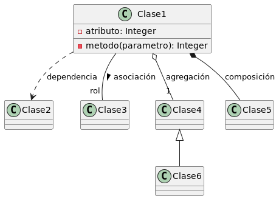
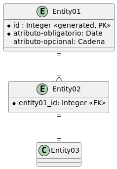

# Mi Gran Proyecto

...

## Algunas ideas:

* ¿Cómo escribir un fichero README.md? https://www.makeareadme.com/
* Un  [ejemplo](https://gist.github.com/PurpleBooth/109311bb0361f32d87a2)
* ¿Qué tal una probar una app? https://readme.so

## Diagrama de Clases

 
> Nota: para modificar el diagrama puedes editar el fichero `.puml` y con el botón derecho
> sobre el diagrama visualizado almacenar la imagen generada y referenciarla dentro de este documento 

## Diagrama ER

